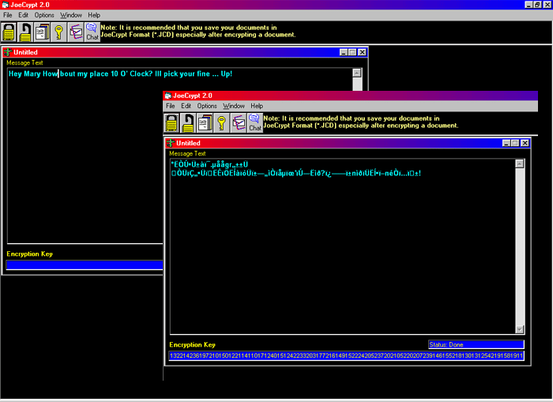



## JoeCrypt2

### Description

This is a text encryption program I began writing when I was 12 I am 18 now and the code has changed many times Ive added many new features over the years. This has been my baby, my pride and joy. Its simple to understand but man is it effective. It has option for encrypted Chat Encrypted Email. Some of the code in this project was taken from planet source, I beleive the only thing I borrowed was the smtp emailer code so I could make it send email. I have been reluctant for years to put this on PSC but now I think its time to just let it go and see what everyone thinks of it.
 
### More Info
 

             |
---                |---
**Submitted On**   |2001-05-23 23:20:14
**By**             |[Kris  Bray](https://github.com/Planet-Source-Code/PSCIndex/blob/master/ByAuthor/kris-bray.md)
**Level**          |Intermediate
**User Rating**    |3.3 (20 globes from 6 users)
**Compatibility**  |VB 4\.0 \(32\-bit\), VB 5\.0, VB 6\.0
**Category**       |[Encryption](https://github.com/Planet-Source-Code/PSCIndex/blob/master/ByCategory/encryption__1-48.md)
**World**          |[Visual Basic](https://github.com/Planet-Source-Code/PSCIndex/blob/master/ByWorld/visual-basic.md)
**Archive File**   |[JoeCrypt2201025262001\.zip](https://github.com/Planet-Source-Code/kris-bray-joecrypt2__1-23477/archive/master.zip)

